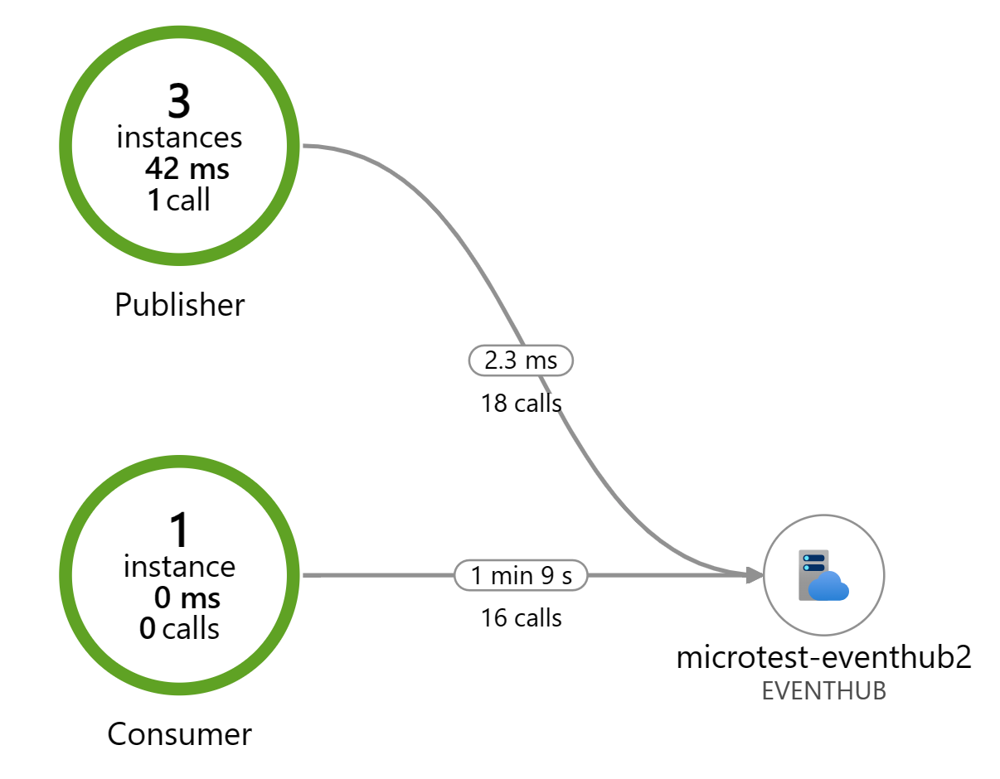

# microtest
Experiments with microservices using simple services written in golang. GitHub actions will be used to build and deploy the microservices in Azure Kubernetes Service. The services will use App Insights for observability.

# Code structure

publisher
A service that publishes messages to a queue. It has an endpoint that accepts a POST request (defaul port 8080) with a message in the body and a count that determines how many times the message will be sent. The message (or messages) is then published to a EventHubs topic.

consumer
A service that consumes messages from a topic in EventHubs.

common
This folder contains shared code that is used by both the publisher and consumer services.
* telemetry - logging telemetry data to App Insights
* messaging (TODO) - code to handle all interaction with EventHubs (pubsub)

# Build & Deployment

Build and deployment are done using Github Actions.

First the image is compiled and pushed to Azure Container Registry. Each service has its own Dockerfile to create the microservice image.

Once the image is built and published in ACR, the workflow will deploy the image in Azure AKS cluster.

In folder k8s you'll find the Kubernetes deployment files:
* publisher-deployment.yaml - manages the deployment of publisher microservice
* publisher-service.yaml - manages the deployment of a Loadbalancer that will open port 80 and redirect requests to PODs running service publisher (round robin load balancing).

# Cross cutting features

## Telemetry

The telemetry is handled by package telemetry.go (folder telemetry). I'm using App Insights to trace all microservice actions.

The application map in App Insights will show the relationship between the publisher and consumer services.



## Messaging

The messaging to event hubs is handled by package messaging.go (folder messaging).
It implements both publish and subscribe methods using the Azure SDK for Go.

## Configuration

### Environment Variables

For now, the configuration is managed using environment variables:
* telemetry: APPINSIGHTS_INSTRUMENTATIONKEY - App Insights key
* publisher: PORT - Port that will be listening to requests
* publisher: EVENTHUB_PUBLISHER_CONNECTION_STRING - Event Hubs publisher connection string
* consumer: EVENTHUB_CONSUMER_CONNECTION_STRING - Event Hubs consumer connection string

    In k8s deployment file, the environment variables are set:

```yaml
        - name: EVENTHUB_CONSUMER_CONNECTION_STRING
          valueFrom:
            secretKeyRef:
              name: eventhubconsumer
              key: eventhubconsumerconnectionstring
```

    And then, the secret needs to be created in the AKS cluster:

```bash
kubectl create secret generic eventhubconsumer --from-literal=eventhubconsumerconnectionstring="Endpoint=sb://<yournamespace>.servicebus.windows.net/;SharedAccessKeyName=<yourkeyname>;SharedAccessKey=<yourkey>;EntityPath=<yourentitypath>"
```

// TODO: Currently these environment variables are set in K8S deployment file (publisher-deployment.yaml). This is not ideal and should be managed in a more dynamic way.
// TODO: move this configuration to App Config service in Azure. How to dynamically configure PORT in publisher-service?


### Partition lease process

The consumer service uses a partition lease process to manage the partitions in EventHubs. The consumer service will lease a partition and process the messages in that partition, each POD will get a partition assigned.

I'm using storage account to store the lease information. The lease is a blob file that contains the partition id and the offset of the last message processed.

Blob name: partitionlease


## Testing

To send a message to the publisher service, you can use curl:

```bash
curl -X POST -H "Content-Type: application/json" -d "{\"content\": \"your_content_here\", \"count\": 10}" http://<ip address>:80/publish
```